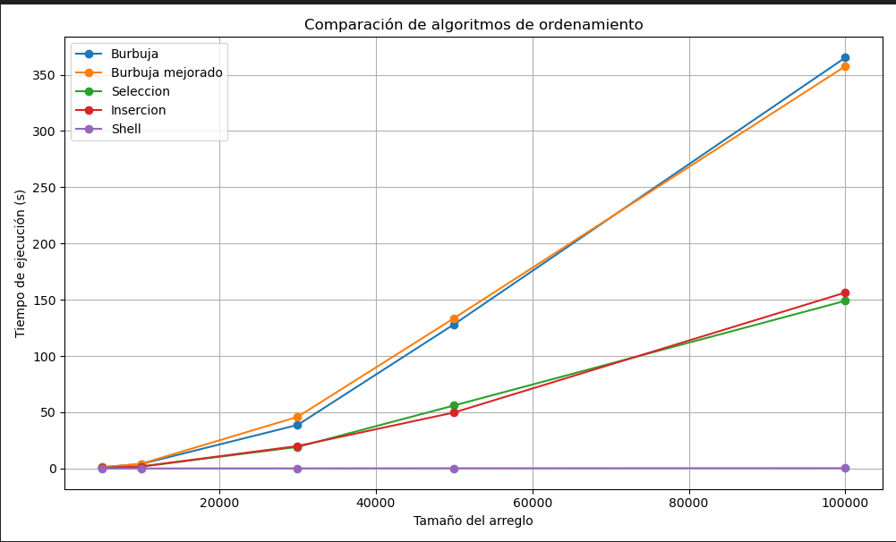

# Práctica de la Teoria de la complejidad

## 📌 Información General

- **Título:** Práctica de la Teoria de la complejidad
- **Asignatura:** Estructura de Datos
- **Carrera:** Computación
- **Estudiante:** Mateo Cordero, Michael Yumbla
- **Fecha:** 10/05/2025
- **Profesor:** Ing. Pablo Torres

---

## 🛠️ Descripción

Este proyecto compara empíricamente el rendimiento de 5 algoritmos de ordenamiento clásicos mediante análisis experimental, midiendo sus tiempos de ejecución con diferentes tamaños de datos. El estudio incluye:

- **Algoritmos evaluados**:
  - Burbuja (Bubble Sort)
  - Burbuja Optimizado
  - Selección (Selection Sort)
  - Inserción (Insertion Sort)
  - Shell Sort

- **Características del estudio**:
  - Tamaños de datos desde 5,000 hasta 100,000 elementos
  - Arreglos generados aleatoriamente con valores entre 0-99999
  - Mediciones precisas con `time.perf_counter()`
  - 5 repeticiones por algoritmo y tamaño
  - Análisis de complejidad temporal (notación Big O)
  - Submuestreo progresivo


---

## 🚀 Ejecución

Para ejecutar el proyecto:

1. Compila el código:
    ```bash
    python app.py
    ```
2. Ejecuta la aplicación:
    ```bash
    python app.py --verbose
    ```

---

## 🧑‍💻 Ejemplo de Entrada

```plaintext
Funciona
Benchmarking instanciado
Tamano: 5000, Algoritmo: Burbuja, Tiempo: 1.075 segundos
Tamano: 5000, Algoritmo: Burbuja mejorado, Tiempo: 1.102 segundos
Tamano: 5000, Algoritmo: Seleccion, Tiempo: 0.470 segundos
Tamano: 5000, Algoritmo: Insercion, Tiempo: 0.467 segundos
Tamano: 5000, Algoritmo: Shell, Tiempo: 0.010 segundos
Tamano: 10000, Algoritmo: Burbuja, Tiempo: 3.945 segundos
Tamano: 10000, Algoritmo: Burbuja mejorado, Tiempo: 4.144 segundos
Tamano: 10000, Algoritmo: Seleccion, Tiempo: 1.633 segundos
Tamano: 10000, Algoritmo: Insercion, Tiempo: 1.719 segundos
Tamano: 10000, Algoritmo: Shell, Tiempo: 0.021 segundos
Tamano: 30000, Algoritmo: Burbuja, Tiempo: 38.674 segundos
Tamano: 30000, Algoritmo: Burbuja mejorado, Tiempo: 45.878 segundos
Tamano: 30000, Algoritmo: Seleccion, Tiempo: 19.114 segundos
Tamano: 30000, Algoritmo: Insercion, Tiempo: 19.943 segundos
Tamano: 30000, Algoritmo: Shell, Tiempo: 0.095 segundos
Tamano: 50000, Algoritmo: Burbuja, Tiempo: 128.198 segundos
Tamano: 50000, Algoritmo: Burbuja mejorado, Tiempo: 133.655 segundos
Tamano: 50000, Algoritmo: Seleccion, Tiempo: 56.006 segundos
Tamano: 50000, Algoritmo: Insercion, Tiempo: 49.753 segundos
Tamano: 50000, Algoritmo: Shell, Tiempo: 0.199 segundos
Tamano: 100000, Algoritmo: Burbuja, Tiempo: 365.359 segundos
Tamano: 100000, Algoritmo: Burbuja mejorado, Tiempo: 357.642 segundos
Tamano: 100000, Algoritmo: Seleccion, Tiempo: 149.036 segundos
Tamano: 100000, Algoritmo: Insercion, Tiempo: 156.398 segundos
Tamano: 100000, Algoritmo: Shell, Tiempo: 0.288 segundos

```````

## ⚡ Tabla de Tiempos de Ejecución (segundos)

| Algoritmo           | 5,000 elementos | 10,000 elementos | 30,000 elementos | 50,000 elementos | 100,000 elementos |
|---------------------|-----------------|------------------|------------------|------------------|-------------------|
| Burbuja             | 1.075           | 3.945            | 38.674           | 128.198          | 365.359           |
| Burbuja mejorado    | 1.102           | 4.144            | 45.878           | 133.655          | 357.642           |
| Selección           | 0.470           | 1.633            | 19.114           | 56.006           | 149.036           |
| Inserción           | 0.467           | 1.719            | 19.943           | 49.753           | 156.398           |
| Shell               | 0.010           | 0.021            | 0.095            | 0.199            | 0.288             |
`


## 📈 EJEMPLO DE ADICIÓN DE DATOS EN ESTE INFORME
 



## 🔚 CONCLUCIONES CON TERMINOLOGIA DE NOTACION 


La comparación de tiempos de ejecución revela patrones claros acordes a la complejidad teórica de cada algoritmo:

### Burbuja y Burbuja Optimizado :

Complejidad: O(n²) en caso promedio y peor caso.

Relación observada: Los tiempos se cuadruplican al doblar el tamaño de entrada (ej: 5k → 10k elementos = 3.67× aumento), comportamiento típico de algoritmos cuadráticos.

### Selección e Inserción :

Complejidad: O(n²) en todos los casos.

Relación observada: Aunque ambos son cuadráticos, Inserción supera a Selección en datasets grandes (50k elementos: 49.75s vs 56s) debido a constantes operacionales más bajas en su implementación.

### Shell Sort :

Complejidad: O(n log n) en caso promedio.

Relación observada: Tiempos crecen casi linealmente (100k elementos = 0.288s vs 5k elementos = 0.010s), demostrando eficiencia superior en complejidad sub-cuadrática.

### Implicaciones prácticas :

Para *n = 100k*:

Shell Sort es 1,240× más rápido que Burbuja (0.288s vs 357s), brecha que crece exponencialmente con *n*.

Los métodos O(n²) requieren minutos/horas para n > 500k, mientras Shell Sort mantiene tiempos en segundos.

## 👨‍💻 Submuestreo Progresivo :

Se genera un único arreglo grande (ej. 100k elementos) y de él se extraen subconjuntos progressivamente más grandes, garantizando que:

- Cada subarreglo contiene todos los elementos del anterior

- Los primeros elementos son idénticos en todos los tamaños

Además, La tecnica submuestreo progresiva asegura que las comparaciones entre algoritmos sean válidas y significativas, ya que las diferencias en tiempo de ejecución se deben únicamente al rendimiento del algoritmo y no a variaciones en los datos de entrada.
